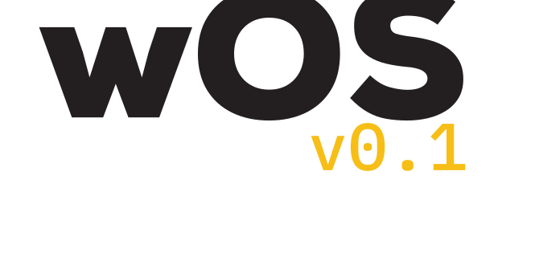

  

<h3 align="center">The open behavioral design standard for AI agents.</h3>

  <a href="SPECIFICATION.md">Read the Spec</a> · <a href="CONTRIBUTING.md">Contribute</a> · <a href="https://wos.wgnr.ai">Website</a>

  
  
  

---

## What it is

wOS governs five behavior domains an agent must master to be trustworthy: **communication**, **verification**, **escalation**, **delegation**, and **memory**. The standard is a specification, not a framework. wOS does not replace your agent runtime, your model, or your orchestration layer. It sits on top of them, defining the behavioral contract an agent must satisfy to interoperate safely with humans, peers, and downstream systems. Read the spec, adopt the directives, ship an agent that behaves.

## Why it exists

AI agents are technically capable and behaviorally incoherent. They hedge when they should escalate, ghost-complete tasks they have not started, and invent citations because they cannot tell you what they do not know. These are not edge cases — they are the default state of the field.

Other standards cover adjacent layers: **ACS** specifies what an agent is not allowed to do. **AGENTS.md** specifies what an agent should know. **Agent OS** specifies how an agent should write code. None specify how an agent should behave. wOS fills the gap.

The doctrine is production-tested — it was authored inside [wgnr.ai](https://wgnr.ai), a brand agency that has run these agents in client work since GPT-3.5.

## How to adopt it

1. **Read** the [SPECIFICATION.md](SPECIFICATION.md)
2. **Add** the wOS directives to your agent's system prompt or runtime configuration
3. **Validate** against the published compliance checks
4. **Declare** your conformance level — Core, Extended, or Strict — in your agent's manifest

The lowest-friction entry point is the **verification domain**: a single directive that forces the agent to surface what it does not know before it claims completion.

## Conformance levels

| Level | Domains | Who should adopt |
|---|---|---|
| **Core** | Communication + Verification | Any agent that interacts with humans |
| **Extended** | Core + Escalation + Delegation | Multi-agent systems, production orchestrators |
| **Strict** | Extended + Identity + Memory | Long-running agents with persistent state |

## Competitive landscape

wOS does not compete with adjacent standards. It occupies the quadrant they leave open.

| Standard | What it governs | Relationship |
|---|---|---|
| [ACS](https://github.com/microsoft/agent-governance-toolkit) (Microsoft) | Security policy | Complementary — security vs. behavior |
| [AGENTS.md](https://agents.md/) (AAIF) | Context and instructions | Complementary — knowledge vs. behavior |
| [Agent OS](https://buildermethods.com/agent-os) (Builder Methods) | Coding standards | Complementary — code quality vs. behavior |
| [OASB-2](https://oasb.ai/oasb-2) / SOUL.md (OpenA2A) | Security behavioral controls | Complementary — security controls vs. operational behavior |
| [Ringer](https://github.com/NateBJones-Projects/ringer) (Nate B. Jones) | Parallel agent orchestration | Complementary — orchestration vs. behavioral doctrine |

## License

Apache-2.0. See [LICENSE](LICENSE).

## Contributing

See [CONTRIBUTING.md](CONTRIBUTING.md).

---

*Built by [wgnr.ai](https://wgnr.ai) — wOS v0.1. Human + AI, by design_*
